# Wallet Service v1 Diagrams

## 1. Use Case Diagram

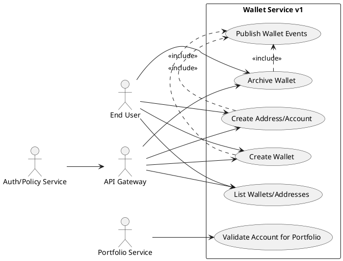

## 2. Class Diagram

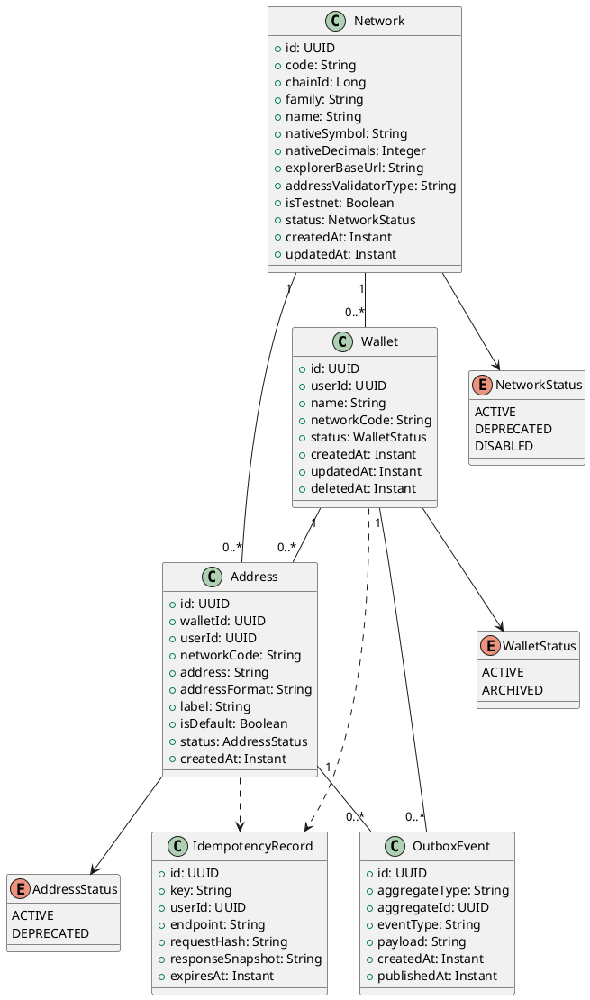

## 3. Flow A - Create Wallet + Account

### 3.1 State Diagram

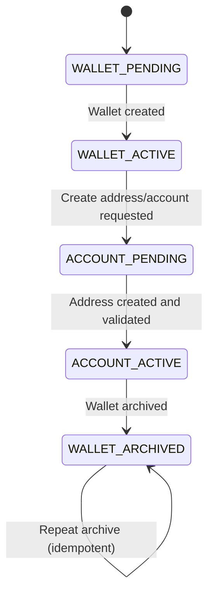

### 3.2 Activity Diagram

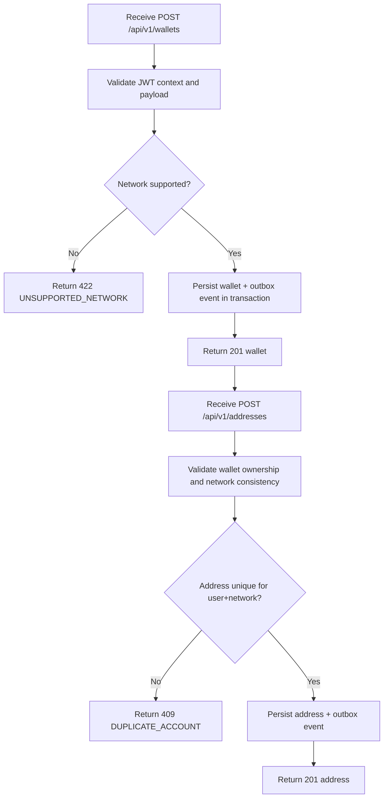

### 3.3 Sequence Diagram

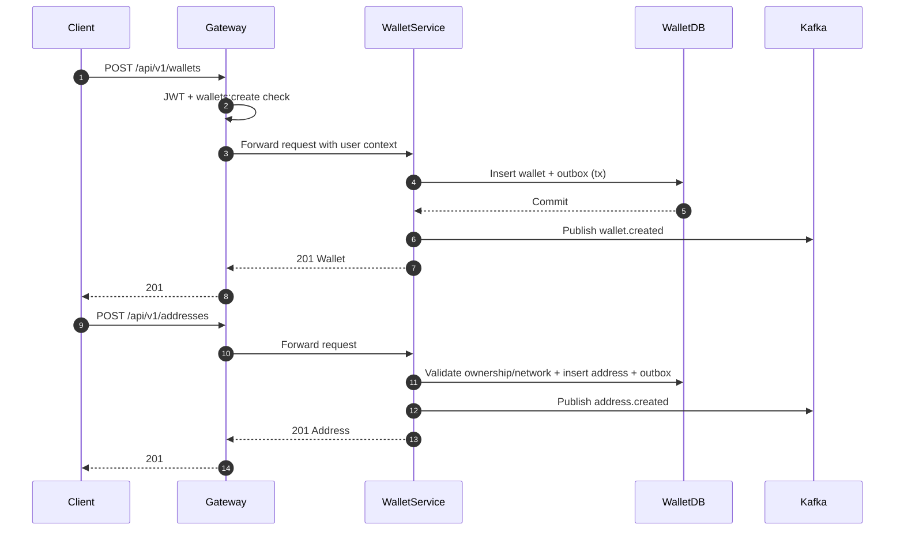

## 4. Flow B - Attach Account To Portfolio

### 4.1 State Diagram

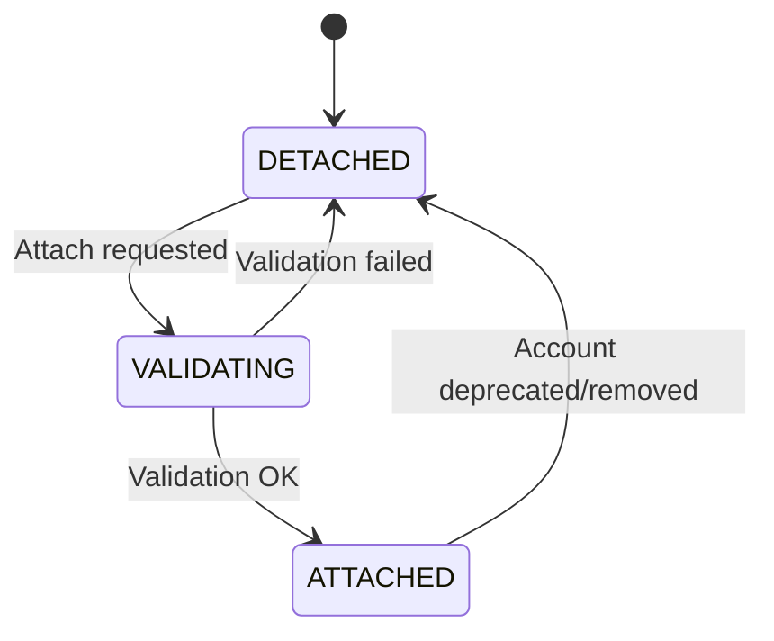

### 4.2 Activity Diagram

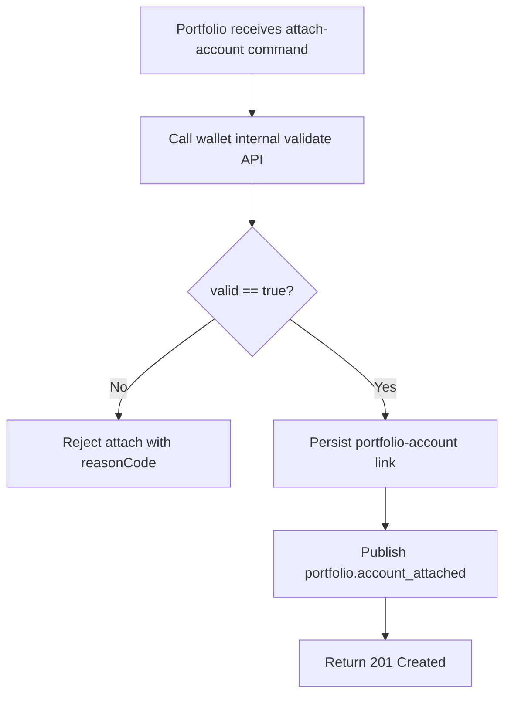

### 4.3 Sequence Diagram

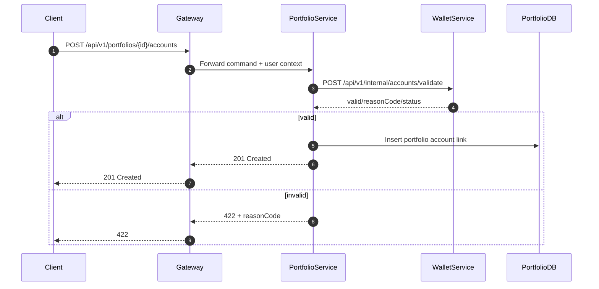

## 5. Flow C - Multi-Network Validation

### 5.1 State Diagram

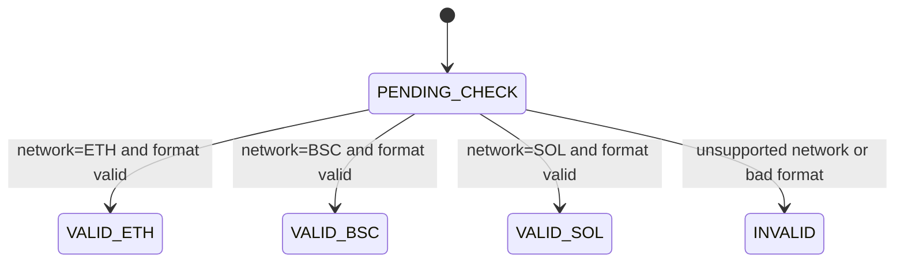

### 5.2 Activity Diagram

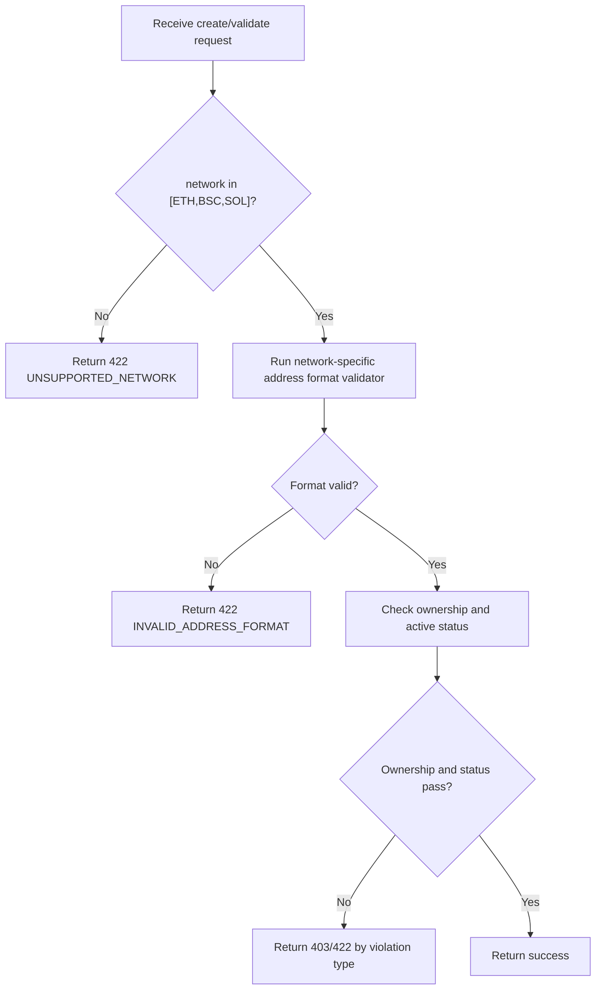

### 5.3 Sequence Diagram

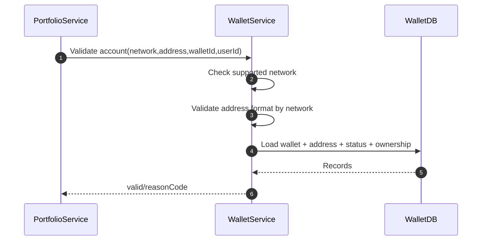

## 6. Flow D - Network Catalog Sync To Portfolio

### 6.1 State Diagram

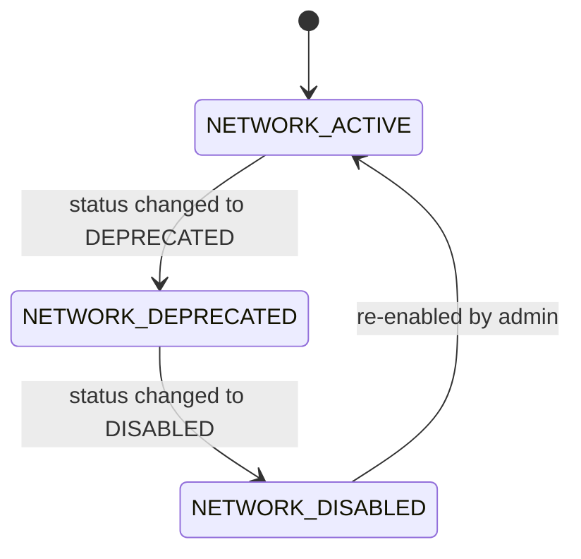

### 6.2 Activity Diagram

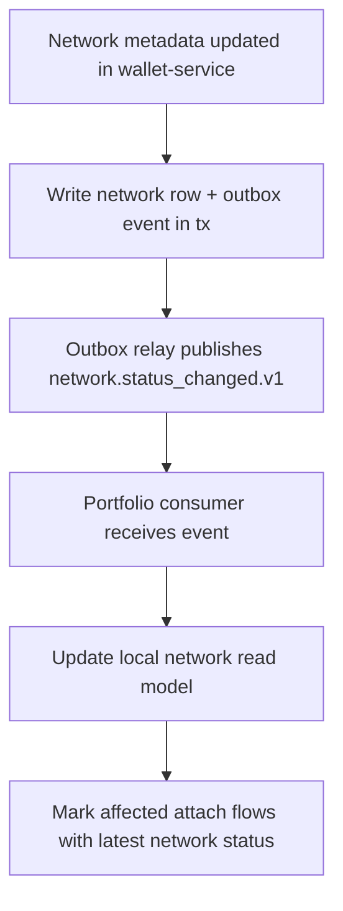

### 6.3 Sequence Diagram

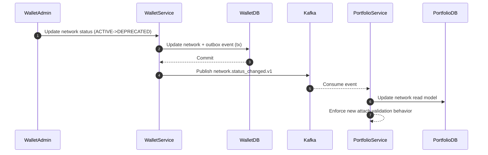
